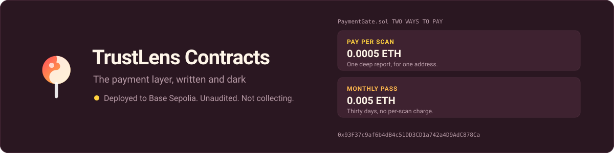
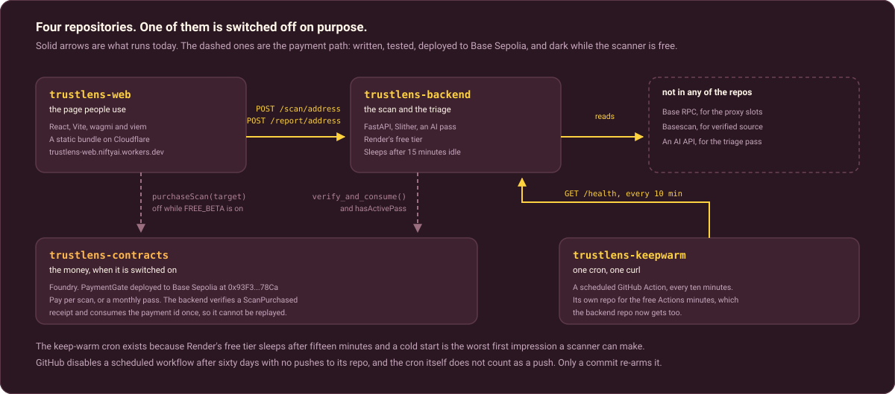

<p align="center">
  
</p>

<p align="center">
  <a href="https://github.com/IgorCSIS/trustlens-contracts/actions/workflows/test.yml"></a>
  
  
  
  
</p>

# TrustLens: the contracts

The on-chain monetization layer for **TrustLens**, an AI smart-contract safety
scanner. `PaymentGate` gates access to the paid AI report: a user pays a small
fee on **Base** and the backend verifies the payment on-chain before returning a
report. Payments are built but currently dark (TrustLens is in free beta), so
this is the code that turns the product on when the time comes.

### Part of TrustLens · the first tool in the [SafuLens](https://x.com/SafuLens) suite
- **[Live app](https://trustlens-web.niftyai.workers.dev)**: try the scanner, no wallet or signup
- **[Frontend](https://github.com/IgorCSIS/trustlens-web)**: React with wagmi and viem
- **[Backend](https://github.com/IgorCSIS/trustlens-backend)**: FastAPI, Slither and an AI triage pass
- **Contracts** (this repo): Foundry, `PaymentGate`

**Deployed:** `PaymentGate` on Base Sepolia at [`0x93F37c9af6b4dB4c51DD3CD1a742a4D9AdC878Ca`](https://sepolia.basescan.org/address/0x93F37c9af6b4dB4c51DD3CD1a742a4D9AdC878Ca).

---

## Where this sits

<p align="center">
  
</p>

This repository is the bottom-left box, and both arrows reaching it are
dashed. That is the honest state of things: the contract is written, tested
and deployed, the backend knows how to verify a payment against it, and the
whole path is switched off behind `FREE_BETA` because the scanner is free
right now.

## What's here

| File | Purpose |
|------|---------|
| `src/PaymentGate.sol` | Pay-per-scan + monthly pass. `Ownable` + `ReentrancyGuard`, custom errors, exact-payment invariant. Emits `ScanPurchased` (the backend verifies this) and `PassPurchased`. |
| `test/PaymentGate.t.sol` | Unit + fuzz tests: happy paths, reverts, access control, withdraw, pass lifecycle. |
| `test/ProxyResolution.t.sol` | Base-fork test that locks the backend's proxy storage-slot resolution against live USDC. |
| `script/Deploy.s.sol` | Deploy script with env-configurable prices and testnet defaults. |

## Product model

- **Pay-per-scan.** Pay `scanPrice`, get one deep report for one target. The
  backend matches the on-chain `paymentId` to the report request and consumes it
  once (anti-replay).
- **Monthly pass.** Pay `passPrice` for `passDuration` of unlimited scans. The
  backend checks `hasActivePass(user)`.

## Quickstart

```bash
forge build
forge test -vv                          # unit + fuzz
forge test --match-contract ProxyResolution   # Base-fork slot test
```

## Deploy to Base Sepolia

```bash
cp .env.example .env          # set an RPC; the public https://sepolia.base.org works
cast wallet import deployer --interactive   # encrypted keystore, never a raw key
forge script script/Deploy.s.sol:DeployPaymentGate \
  --rpc-url base_sepolia --account deployer --broadcast --verify -vvvv
```

## Security posture

- The owner key controls prices and withdrawals. On a real mainnet deployment it
  should be a multisig (Safe), not a hot EOA, and the key must never live on the
  backend server.
- `withdraw` uses a checked `.call`, has a zero-address guard, and is
  `nonReentrant`.
- Private keys stay on your machine in an encrypted keystore or a gitignored
  `.env`. Nothing sensitive is committed (verified: no `.env` in history).
- Before this contract holds real funds: run Slither + Aderyn + Mythril, add
  Foundry invariant tests, and get a community review. It is unaudited today.

## License

[MIT](LICENSE)
